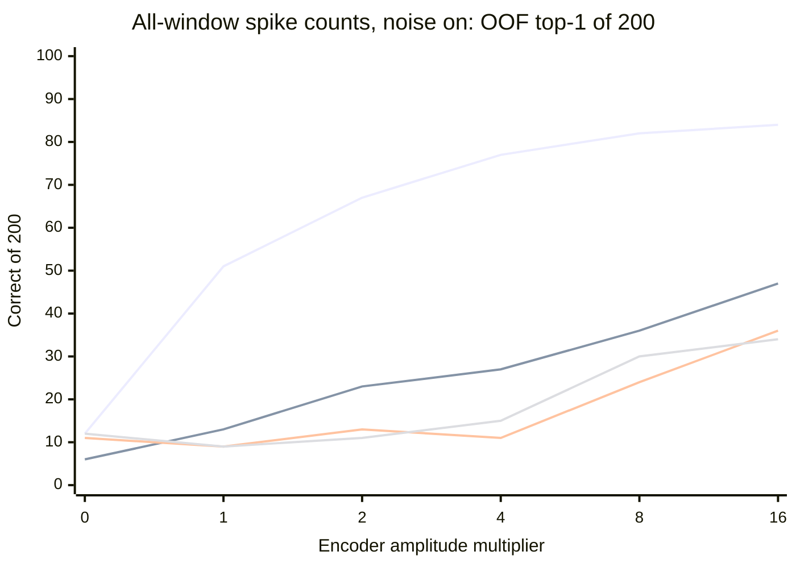

## T32 results: the loss starts at injection, strong drive restores delivery only at the simulator's maximum, and the network state holds no memory

All nine preregistered conditions were recorded and decoded by the committed code at `dfc958d`, with no change to the protocol. Every condition used the same 280 training photographs (200 decoded with the exact T29 folds and the unchanged T30 readout), the original graph, dynamics, warmup and 16 windows. The formal recording at the original amplitude reproduced the scratch pilot **bit for bit** in every population, which cross-checks the two independent recorder implementations. No validation, historical test, reserve or previously inspected query photograph was used.

### Reference and negative control

- Encoded current, all 16 windows: **92/200**, log loss **2.3766**, which reproduces T30 exactly (2.37658) now that the decode ran with one BLAS thread as T30 did. Pixels: 88/200.
- Encoded current of the **last window alone: 22/200** (pixels 23/200). A single glimpse carries little identity, so the task genuinely requires combining glimpses.
- Blank stimulus (s = 0) with the same per-photograph noise streams: every population scores 6 to 14/200. Chance is 10/200. The noise streams, which are keyed by sample identifier, leak no label information.

### Identity decoding by population and condition

Cells show fit-only OOF top-1 correct out of 200 and OOF log loss. **Bold** marks the preregistered "delivery restored" criterion (≥ 46/200 and log loss < ln 20 = 2.996). `sN-on` is amplitude multiplier N with the original episode noise, `sN-off` the same drive without episode noise. s16 equals `flybrain`'s own 0.8 V/step visual drive.

#### All-window spike counts, OOF top-1 correct of 200 (log loss)

| Population | s0-on | s1-on | s2-on | s4-on | s8-on | s16-on | s1-off | s4-off | s16-off |
| --- | ---: | ---: | ---: | ---: | ---: | ---: | ---: | ---: | ---: |
| Driven neurons (control) | 12 (3.02) | **51** (2.67) | **67** (2.42) | **77** (2.32) | **82** (2.29) | **84** (2.26) | 49 (3.06) | **81** (2.34) | **85** (2.25) |
| Other visual projection | 12 (3.01) | 9 (3.01) | 11 (2.99) | 15 (2.93) | 30 (2.77) | 34 (2.65) | 20 (2.97) | 37 (2.73) | **58** (2.80) |
| Central brain | 6 (3.10) | 13 (3.01) | 23 (2.91) | 27 (2.81) | 36 (2.74) | **47** (2.63) | 44 (2.67) | 31 (4.57) | **49** (2.54) |
| Kenyon cells | 14 (2.98) | 10 (3.02) | 7 (3.04) | 7 (3.03) | 9 (3.02) | 14 (3.01) | 20 (2.99) | fail | 15 (4.50) |
| Descending neurons | 11 (3.05) | 9 (3.07) | 13 (3.07) | 11 (3.02) | 24 (2.88) | 36 (2.71) | 28 (2.92) | 24 (3.08) | **47** (2.59) |
| Optic lobe sample | 13 (3.09) | 12 (3.08) | 10 (3.11) | 15 (3.04) | 19 (3.00) | 24 (2.90) | 14 (2.99) | 34 (2.75) | 39 (3.08) |
| VNC intrinsic | 10 (3.02) | 12 (3.02) | 9 (3.05) | 8 (3.01) | 14 (3.00) | 22 (2.87) | 16 (3.23) | 18 (3.98) | 24 (3.18) |

#### Last-window spike counts, OOF top-1 correct of 200 (log loss)

| Population | s0-on | s1-on | s2-on | s4-on | s8-on | s16-on | s1-off | s4-off | s16-off |
| --- | ---: | ---: | ---: | ---: | ---: | ---: | ---: | ---: | ---: |
| Driven neurons (control) | 11 (3.01) | 17 (3.04) | 25 (3.16) | 25 (3.37) | 20 (3.48) | 24 (3.49) | 27 (3.09) | 25 (3.44) | 22 (3.49) |
| Other visual projection | 10 (3.02) | 5 (3.09) | 8 (3.01) | 8 (3.01) | 15 (2.96) | 17 (3.02) | 16 (3.01) | 18 (3.04) | 23 (2.99) |
| Central brain | 7 (3.23) | 7 (3.15) | 6 (3.09) | 10 (3.10) | 19 (3.08) | 17 (3.12) | 17 (2.96) | 13 (3.89) | 11 (3.63) |
| Kenyon cells | 9 (3.00) | 9 (2.99) | 9 (3.00) | 9 (3.00) | 9 (3.00) | 17 (3.00) | 11 (3.01) | fail | 9 (3.09) |
| Descending neurons | 10 (3.13) | 8 (3.06) | 9 (3.07) | 8 (3.13) | 13 (3.05) | 19 (2.93) | 4 (2.99) | 13 (3.15) | 12 (3.03) |
| Optic lobe sample | 8 (3.06) | 6 (3.06) | 10 (3.05) | 10 (3.08) | 10 (3.06) | 14 (3.01) | 10 (3.00) | 6 (3.04) | 21 (3.06) |
| VNC intrinsic | 12 (3.06) | 14 (3.00) | 10 (3.01) | 7 (3.12) | 12 (3.08) | 7 (3.04) | 9 (3.03) | 5 (3.32) | 15 (3.44) |

#### Final voltage, OOF top-1 correct of 200 (log loss)

| Population | s0-on | s1-on | s2-on | s4-on | s8-on | s16-on | s1-off | s4-off | s16-off |
| --- | ---: | ---: | ---: | ---: | ---: | ---: | ---: | ---: | ---: |
| Driven neurons (control) | 7 (3.14) | 16 (3.05) | 19 (3.04) | 22 (3.22) | 23 (3.31) | 22 (3.47) | 32 (3.23) | 28 (3.16) | 22 (3.46) |
| Other visual projection | 7 (3.16) | 11 (3.10) | 7 (3.17) | 11 (3.12) | 15 (3.10) | 10 (3.21) | 30 (3.41) | 12 (3.86) | 25 (3.39) |
| Central brain | 6 (3.20) | 6 (3.15) | 12 (3.05) | 8 (3.15) | 10 (3.13) | 17 (3.05) | 17 (10.43) | 9 (4.52) | 18 (3.61) |
| Kenyon cells | 13 (3.00) | 6 (2.99) | 18 (2.99) | 13 (3.00) | 14 (2.99) | 11 (2.99) | 18 (4.70) | 8 (3.38) | 5 (3.54) |
| Descending neurons | 6 (3.10) | 10 (3.07) | 10 (3.03) | 12 (3.04) | 7 (3.04) | 7 (3.07) | 14 (5.62) | 14 (3.27) | 14 (3.12) |
| Optic lobe sample | 11 (3.19) | 13 (3.18) | 13 (3.19) | 11 (3.17) | 10 (3.19) | 7 (3.25) | 20 (11.10) | 15 (7.77) | 15 (4.91) |
| VNC intrinsic | 10 (3.08) | 5 (3.06) | 13 (3.05) | 13 (3.08) | 12 (3.09) | 8 (3.06) | 10 (4.07) | 9 (6.84) | 15 (5.33) |

The four lines are, from top to bottom at s = 16: driven neurons, central brain, descending neurons, and other visual projection neurons.

Mean spikes per 10-step window, averaged over the 280 photographs:

| Condition | Driven | Other visual projection | Central brain | Kenyon cells | Descending |
| --- | ---: | ---: | ---: | ---: | ---: |
| s0-on (blank) | 433 | 590 | 21,387 | 40,628 | 311 |
| s1-on | 605 | 591 | 21,466 | 40,628 | 313 |
| s4-on | 1,826 | 606 | 22,202 | 40,628 | 333 |
| s16-on | 5,124 | 825 | 24,360 | 40,628 | 408 |
| s1-off | 155 | 2 | 27 | 0 | 0 |
| s4-off | 1,733 | 58 | 4,743 | 24,442 | 39 |
| s16-off | 5,082 | 330 | 10,177 | 30,611 | 202 |

### Decisions under the preregistered rules

- **H1, input strength: supported.** The central brain meets the delivery criterion at s = 16 with noise on (47/200, log loss 2.63) and fails it at s = 1 (13/200). It is the only non-driven population to cross the threshold with the original noise, and it crosses it only at the largest amplitude tested, by one photograph. Descending neurons, the original readout, stay below it (36/200) with noise on.
- **Operating amplitude: provisionally s = 16**, the smallest amplitude at which the central brain meets the criterion. The protocol requires a replication with episode-noise seed 1 before adoption. That replication is running and will be reported here.
- **H2, population access: supported descriptively.** At every amplitude the ranking is driven neurons, then central brain, then descending neurons and other visual projection neurons, then the optic-lobe sample and VNC, with Kenyon cells last. Decodability falls with distance from the injection site.
- **H3, operating regime: supported.** Removing episode noise raises the central brain from 13 to **44/200** at s = 1 (+31 points), descending neurons from 9 to 28 at s = 1 (+19), other visual projection neurons from 34 to **58** at s = 16 (+24), and descending neurons from 36 to **47** at s = 16 (+11). The background noise masks a large part of the evoked signal.
- **H4, memory in the network state: not supported.** In every population and condition, the last-window counts and the final voltage stay between 4 and 32/200. The final state does not even retain the last glimpse well (the last-window encoded current alone gives 22/200), let alone the earlier ones. All identity information above chance lives in the **all-window** representation, where the linear readout, not the fly, holds the history.
- **Kenyon cells** never carry identity (≤ 20/200 in every condition). With noise on they fire at the 50 Hz ceiling before any stimulus. Without noise, the image itself ignites the same saturation from s = 4 on (24,000 to 31,000 spikes per window). Two s4-off Kenyon-cell fits stopped at L-BFGS's function-evaluation limit before the 50,000-iteration cap. They are recorded as numerical failures and were not refitted or substituted.

### What this establishes, and what it does not

The original spiking model loses identity information at the first steps: converting the injected current into spikes halves it (51 against 92/200), and one synapse later it is at chance. Stronger drive and a quiet network restore delivery to about 45 to 58/200 in some central populations, roughly half of what the input carries. The fly's own state never holds more than a trace of the last glimpse. With this neuron model, the network is at best a lossy feature expander whose history has to be kept by an external readout. That is not the memory this PoC asks for.

T32 cannot tell whether this is a property of the MaleCNS wiring or of the spiking regime that `flybrain` runs on it: hard thresholds with reset to zero, row-normalized weights at gain 3 (linearized loop gain about 3 against a spectral radius of 1), background noise, and a runaway Kenyon-cell loop that takes 56% of each Kenyon cell's input weight. **T33 (#65)** answers that question by running the same effective graph with deterministic graded dynamics, and it tests memory held by the network directly against a reset control.

Resources: recordings took 135 to 431 s each (3 processes × 4 Numba threads), decodes about 13 minutes each with one BLAS thread. The decode attempts, tables and code will be archived with the study. The raw spike-count recordings (about 1.5 GB) are exactly regenerable from the committed code and will be deleted after archiving.
